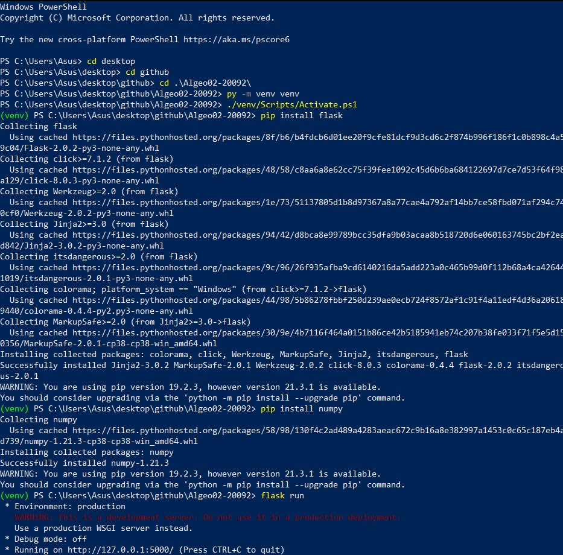
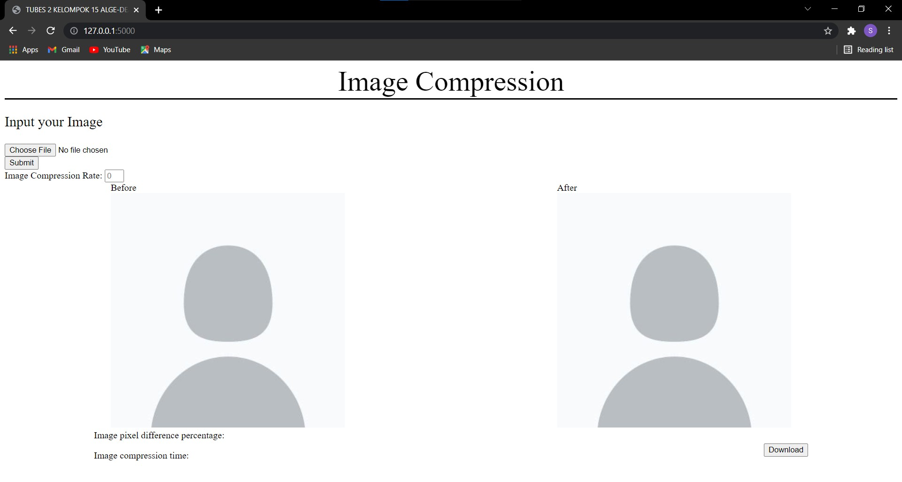

# Tugas Besar 2 IF2123 Aljabar Linier dan Geometri
> Membuat website yang dihost pada lokal yang dapat menerima inputan foto dan persentase kompresi lalu menghasilkan foto yang terkompres lalu foto yang terkompress tersebut kemudian dapat didownload oleh pengguna.

## Daftar Anggota Kelompok
<table>
<tr><td colspan = 3 align = "center">KELOMPOK 15 ALGE-DEAD</td></tr>
<tr><td>No.</td><td>Nama</td><td>NIM</td></tr>
<tr><td>1.</td><td>Vieri Mansyl</td><td>13520092</td></tr>
<tr><td>2.</td><td>Vincent Prasetiya Atmadja</td><td>13520099</td></tr>
<tr><td>3.</td><td>Steven</td><td>13520131</td></tr>
</table>

## Cara Memakai
1. Download atau clone repo ini
2. Jalankan Windows PowerShell
3. Buka folder repo ini
4. Buat Virtual Environment Python
    ```
    py -m venv venv
    ./venv/Scripts/Activate.ps1
    ```
5. Install library yang digunakan
    ```
    pip install flask
    pip install numpy
    ```
6. Jalankan program
    ```
    flask run
    ```
7. Copy IP address dan port yang tertera pada Windows PowerShell
    ```
    Misalnya Tertera:
    * Environment: production
    WARNING: This is a development server. Do not use it in a production deployment.
    Use a production WSGI server instead.
    * Debug mode: off
    * Running on http://127.0.0.1:5000/ (Press CTRL+C to quit)

    Yang dicopy:
    http://127.0.0.1:5000/
    ```
8. Paste hasil copy-an tersebut pada browser

## Tampilan Cara Set-Up Virtual Environtment pada Windows PowerShell


## Tampilan Pada Localhost


## Ucapan Terima Kasih
Kami mengucapkan terima kasih kepada
* Dr. Judhi S. Santoso (Dosen K1 IF2123 Tahun 2021/2022)
* Dr. Rinaldi Munir (Dosen K2 IF2123 Tahun 2021/2022)
* Dr. Rila Mandala (Dosen K3 IF2123 Tahun 2021/2022)
* Semua Asisten IF2123 Tahun 2021/2022
